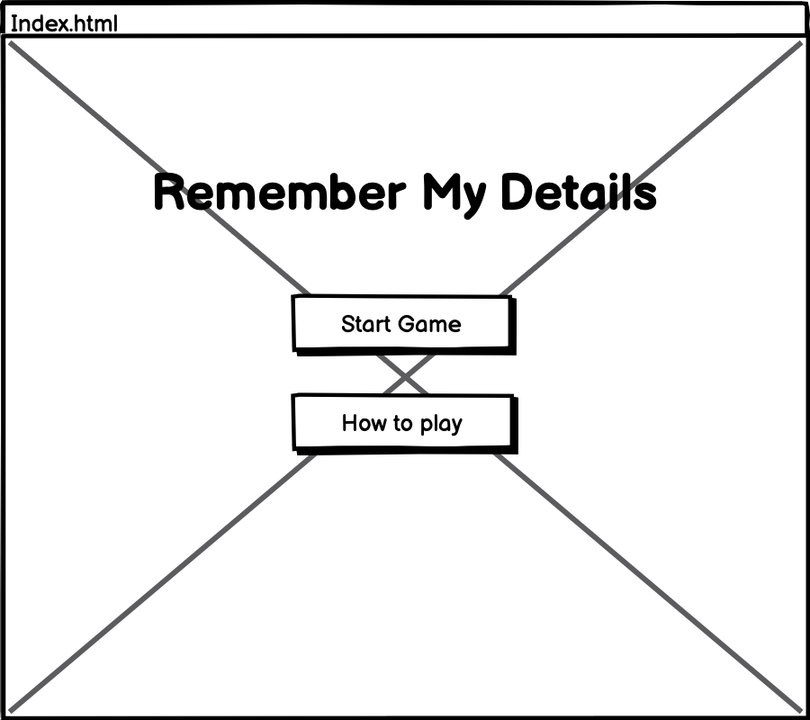
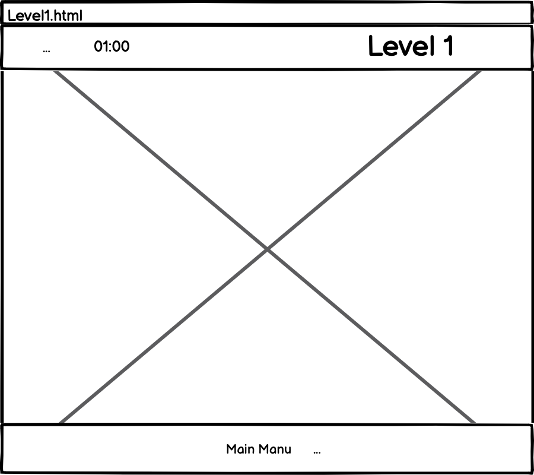
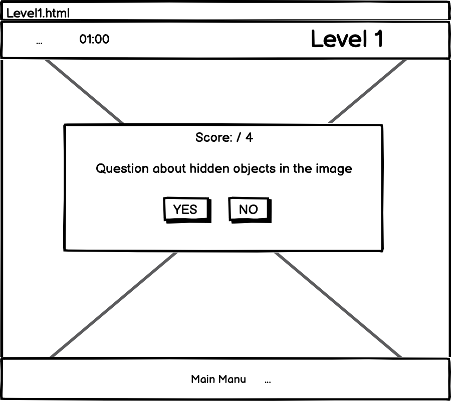
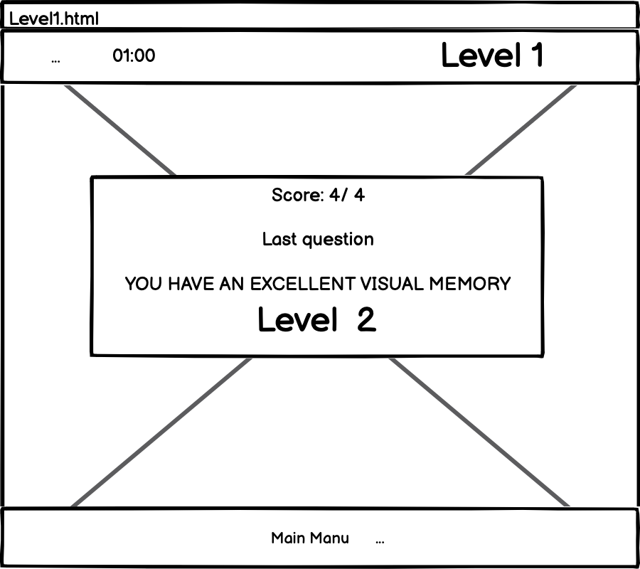
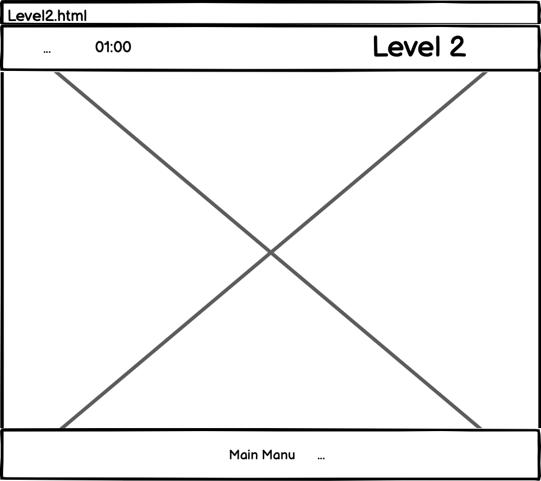
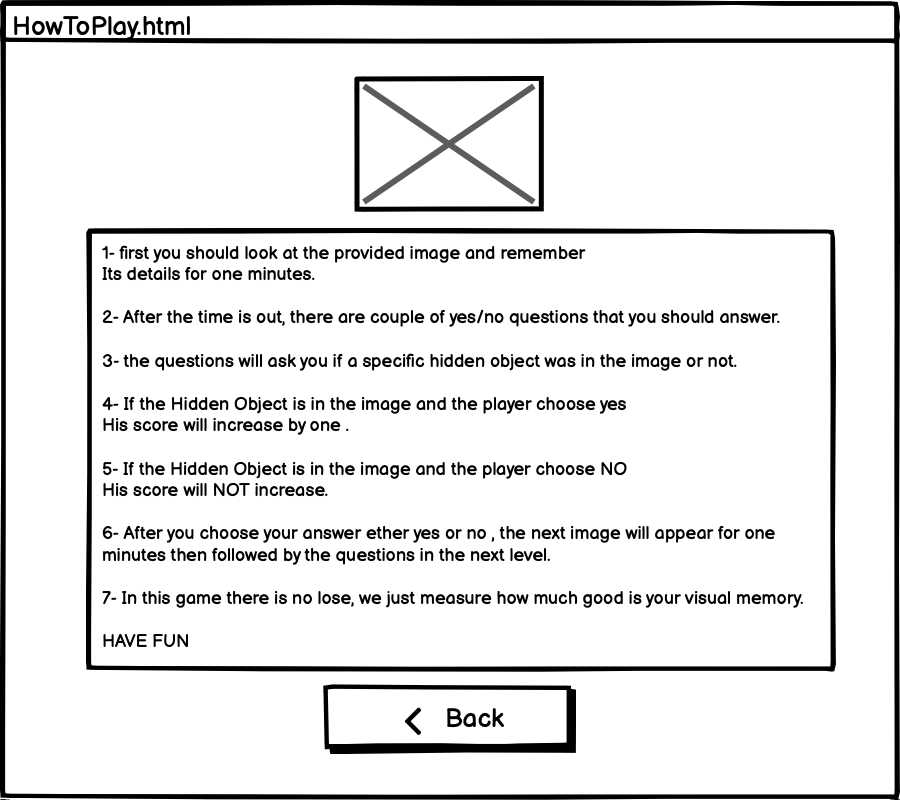

# RememberMyDetails 
List of technologies used in this project:
- HTML
- CSS 
- Java Script
- Jquery

## Wireframes:

## User Stories:
- As a player, I want to remember the details for every image, so that I can answer the questions easily before the time is out.
- As a player, I want to answer all the Yes/No questions, so that I can move to the next level.
- As a player, I want to see my scores, so that I can know if answers are correct or not.
As a player, I want to increase my scores every time I answered correctly so that I can prove how good my visual memory is.