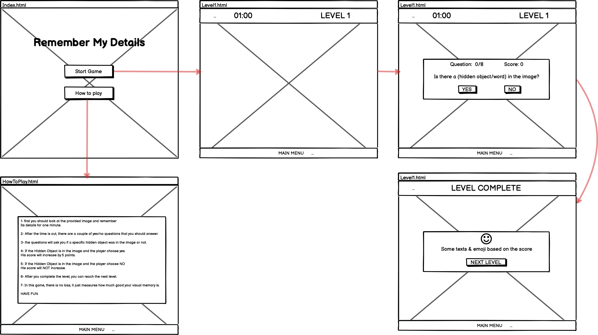

# Remember My Details Game: 
## What is the story behind this game?
Well, if you think you have a good memory, maybe you should try this little simple game that is focused on how much good your visual memory is.

ok seems fun right? then what is the visual memory?

Visual memory is the ability to remember or recall information such as activities, pictures, or words that have been viewed in the past.

can you figure out what the game looks like? yes you're right it's about pictures you have to remember everything in it as if it's a friend :)

that's how the name of the game created ;) 

ARE YOU EXCITED?
## List of technologies used in this project:
- HTML5
- CSS3 
- Java Script
- Jquery
- Font Awesome CDN

## Wireframes:



## User Stories:
- As a player, I want to remember the details for every image, so that I can answer the questions easily before the time is out.
- As a player, I want to answer all the Yes/No questions, so that I can move to the next level.
- As a player, I want to see some effects after I choose my answer, so that I can know what the answer is.
- As a player, I want to see my scores, so that I can know if my answers are correct or not.
- As a player, I want to increase my scores every time I answered correctly so that I can prove how good my visual memory is.
- As a player, I want to play in a game with sound effects and music, so that I can enjoy the game.
- As a player, I want to have instructions about how to play, so that I understand how it works.
- As a player, I want to have buttons and navigations, so that I can move between parts easily.
## Planning/Development process and problem-solving strategy:
- Create New Repository in GitHub Enterprise.
- Prepare the Folders and Files for the game.
  - create README.md
  - create index.html
  - create levels folder
     - create level1.html
  - create css folder 
     - create styles.css
  - create js folder
     - create main.js
  - create images folder 
     - create wireframe folder for wireframe images 
     - create level_1 folder for level 1 image
 - work on the Design of index.html as the main page of the game.
 - work on the first level in level1.html.
 - work on main.js file to build the logic of the game. 
 - make the questions dynamic.
 - Add color/sound effects to the correct and wrong choices.
 - Increase the score of the player for every correct choice and store it in the local storage for later use.
 - Open the next level. 

## Unsolved Problems :
Nothing 
## How to become a winner:
- First, you should be clear-minded and focus on the picture for one minute.
- Then read the questions while trying to imagine what objects/things you saw in the picture.
- Last but not least, I hope you like the game and have fun when playing it.
## My favorite functions:

```javascript
$(document).ready(function () {
    $(".question_box").hide();

    const timeout = function () {

        $(".level2_page").css({
            "filter": "blur(8px)",
            "-webkit-filter": "blur(8px)",
        })
        $(".question_box").show();

        startGame(levelQuestions);
    }
    setTimeout(timeout, 62000);
})
```

this my favorite part of the code which is the core of how each level is unique from others. As you can see I use JQuery here. 
-  make the blur effect and call the startGame function with the levelQuestions which is an [Array of objects] as an argument after 1 minute.
- then the whole work starts from this point for all levels.

## Some useful Resources:

- [Font Awesome icons ~ the web's most popular icon set and toolkit.][https://fontawesome.com/]
- [Animate.css ~ is a library of ready-to-use, cross-browser animations for use in your web projects.][https://animate.style/]